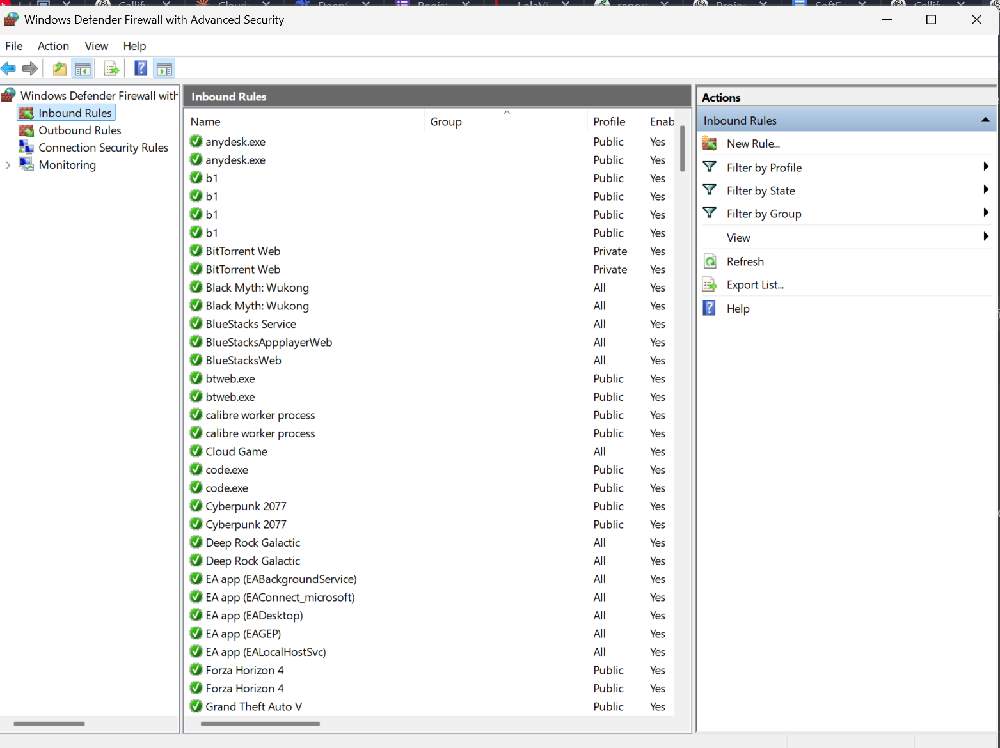
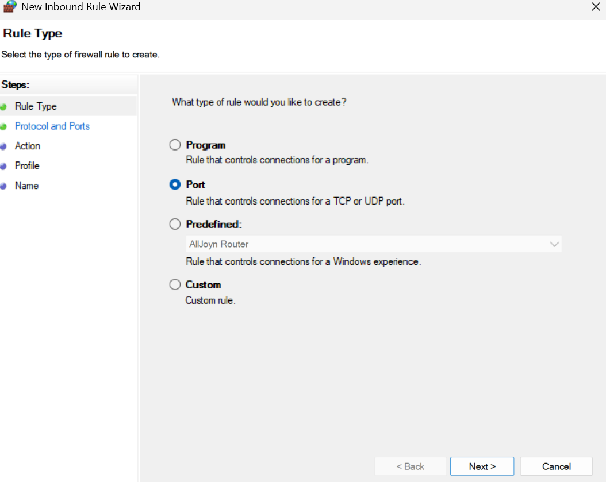

# Callify


A simple peer-to-peer video calling web app using WebRTC and Socket.IO.

---

## 🔍 Table of Contents

- [🛠️ Tech Stack](#️-tech-stack)
- [⚙️ Prerequisites](#-prerequisites)
- [📥 Installation](#-installation)
- [🛡️ SSL Setup](#-ssl-setup)
- [🎬 Usage](#-usage)
- [📡 Server API](#-server-api)
- [✉️ Contact](#-contact)

---

## 🛠️ Tech Stack


### Client (in `public/`)

- Plain HTML, CSS, and JavaScript
- WebRTC for media streaming
- Socket.IO Client for signaling

### Server

- Node.js (Version >= 18)
- Express for static file serving
- Socket.IO for real-time communication
- HTTPS with self-signed or valid SSL certificates

---

## ⚙️ Prerequisites

- Node.js v18 or above
- npm (comes with Node.js)
- OpenSSL to generate SSL certificates
- Devices connected to the same LAN/Wi-Fi for cross-device testing

---

## 🛡️ SSL Setup

To generate self-signed certificates for development:

```bash
openssl genrsa -out server.key 2048
openssl req -new -key server.key -out server.csr
openssl x509 -req -in server.csr -signkey server.key -out server.cert -days 365
```

Make sure `server.key` and `server.cert` are in the root folder so `server.js` can load them.

---

## 📥 Installation

1. Clone the repository or unzip the `.rar` files.
2. Start the backend:
   ```bash
   cd backend
   npm install
   npm install socket.io
   npm install express
   node server.js
   ```
3. Start the frontend:
   ```bash
   cd frontend
   npm install
   npm install socket.io
   npm install express
   node server.js
   ```

> 🔐 **Note:** Make sure the SSL certificates (`server.key` and `server.cert`) are placed in both the frontend and backend directories for the two websites.


---

## 🎬 Usage

### Allow Required Ports

1. Press `Windows + R`, type `wf.msc`, and press Enter.

2. Go to `Inbound Rules` → `New Rule`.

3. Select `Port` and allow:
   - Port `8443`
   - Port `3000`

### Start the Server

1. Start the backend:
   ```bash
   node server.js
   ```
2. Then start the frontend:
   ```bash
   node server.js
   ```

### Access the App

- **Local:** `https://localhost:3000`
- **Network:** `https://<LAN_IP>:3000` (for other devices on the same network)

Open the client in two tabs or devices, enter unique usernames, and initiate a call.

---

## 📡 Server API

### `GET /api/lan-ip` (from frontend server)

Returns the LAN IPv4 address of the machine hosting the frontend server.

#### 📦 Example Response:

```json
{
  "ip": "192.168.1.5"
}
```

## ✉️ Contact

- **Aryan Choudhary** (23115024) | 📞 9625638117 | ✉️ aryan_c1@cs.iitr.ac.in
- **Vishesh Gupta** (23114107) | 📞 8800849502 | ✉️ vishesh_g@cs.iitr.ac.in
- **Harshit Jadwani** (23114035) | 📞 7014264475 | ✉️ harshit_j@cs.iitr.ac.in
- **Siddharth Gupta** (23114093) | 📞 9650804730 | ✉️ siddharth_g@cs.iitr.ac.in
- **Chinni Sai Mohan** (23114020) | 📞 9347289318 | ✉️ mohan_sc@cs.iitr.ac.in
- **Nitin Agiwal** (23114074) | 📞 9352638419 | ✉️ nitin_a@cs.iitr.ac.in

---
